# Professional Personal Portfolio Website

A modern, professional and fully responsive personal portfolio website built with **HTML5 and CSS3**, created as **Task 01** of the **Devixo Solutions Web Development Internship Program**.

**Live Website:** https://my-professional-portfolio2.netlify.app

**GitHub Repository:** https://github.com/raniunsa24-coder/My-Portfolio

---

## Project Description

This portfolio showcases my profile, technical skills, education, projects and contact information through a clean, dark and elegant web interface with a gold accent color. The whole website is designed and styled with my own HTML and CSS code. No Bootstrap, Tailwind CSS, UI frameworks, downloaded templates or JavaScript were used.

## Technologies Used

- **HTML5**: semantic page structure
- **CSS3**: custom styling, Flexbox/Grid layouts, media queries, hover effects and animations
- **Git & GitHub**: version control and repository hosting
- **Netlify**: website deployment

## Website Features

- Fully responsive design (desktop, laptop, tablet and mobile)
- Sticky navigation bar with working links to every section and a CSS-only menu icon on mobile
- Hero section with name, tagline, short introduction, profile image and call-to-action buttons
- Skill cards for the technologies I use
- Education section showing my academic journey
- Project cards with thumbnail, description, technologies used and project links
- "Beyond Coding" section (MUN, debating, organization and volunteering)
- Contact section with email, phone, location, social links and a contact form UI (Name, Email, Subject, Message)
- Smooth scrolling and CSS scroll-reveal animations
- Smooth hover effects on buttons, links and cards
- Consistent dark and gold color theme with good contrast and readable typography
- Footer with copyright and quick navigation links

## Sections

1. Home
2. About
3. Skills
4. Education
5. Projects
6. Activities (Beyond Coding)
7. Contact

## Project Structure

```
My-Portfolio/
├── images/                  # project thumbnails
├── screenshots/             # screenshots used in this README
├── index.html
├── style.css
├── profile.jpg
├── Portfolio Report.pdf
└── README.md
```

## Screenshots

### Desktop View

**Home / Hero Section**

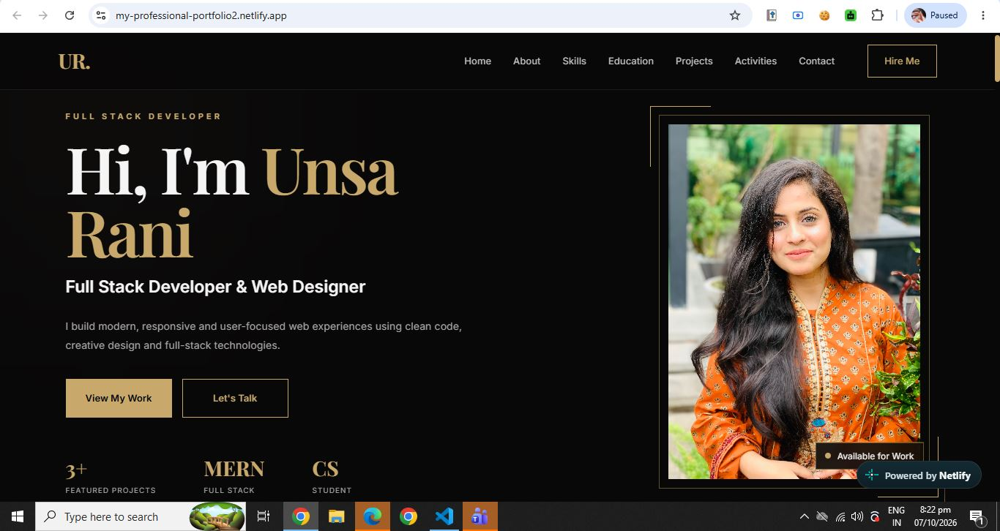

**About Section**

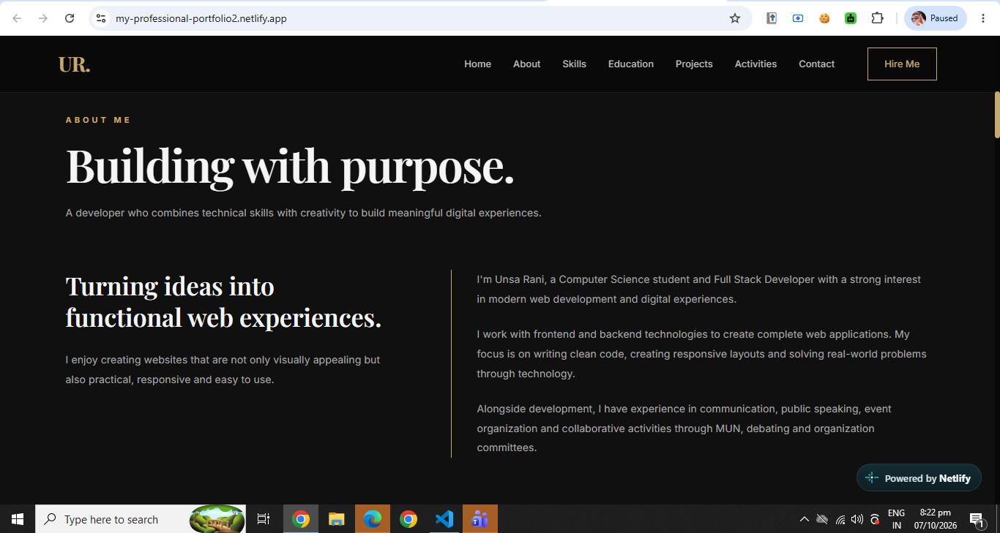

**Skills Section**

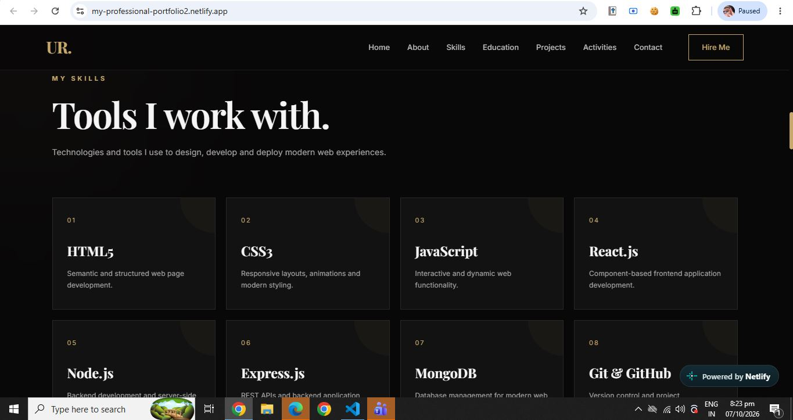

**Education Section**

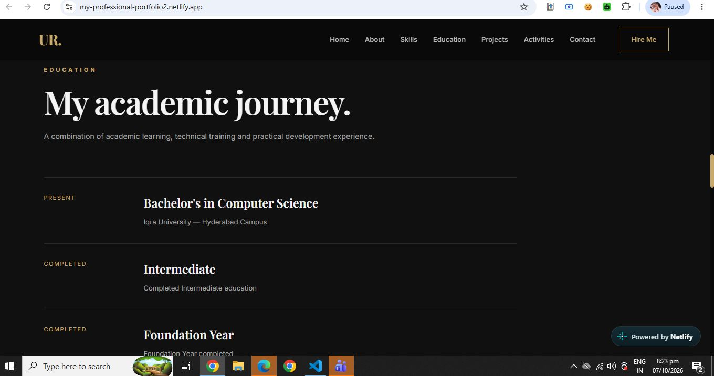

**Projects Section**

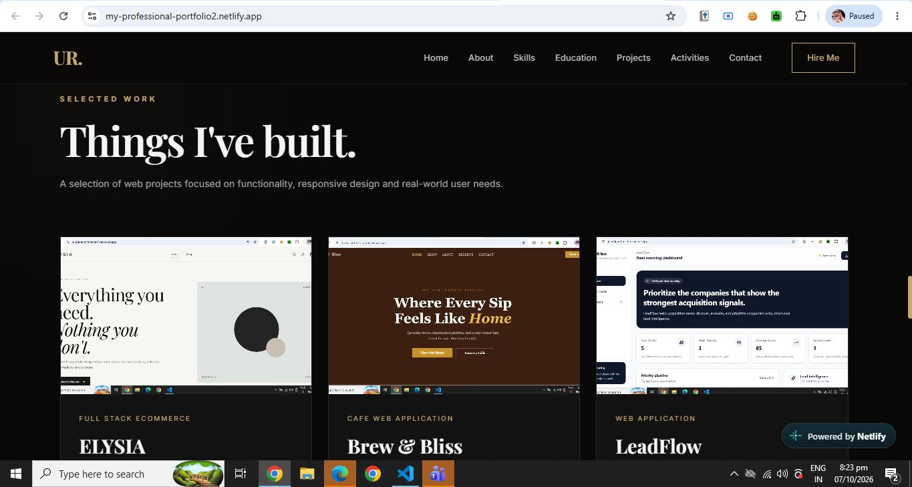

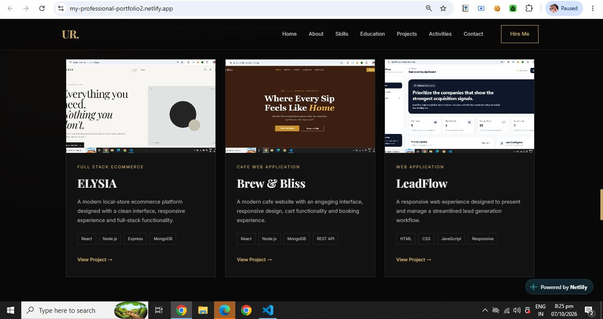

**Activities Section**

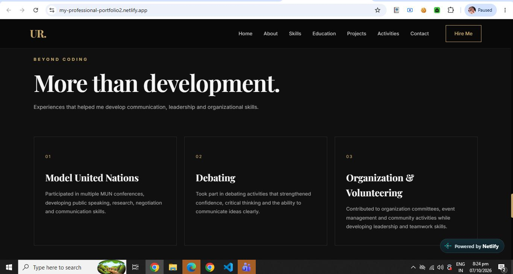

**Contact Section**

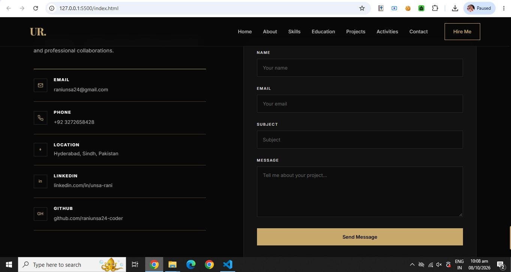

**Footer**

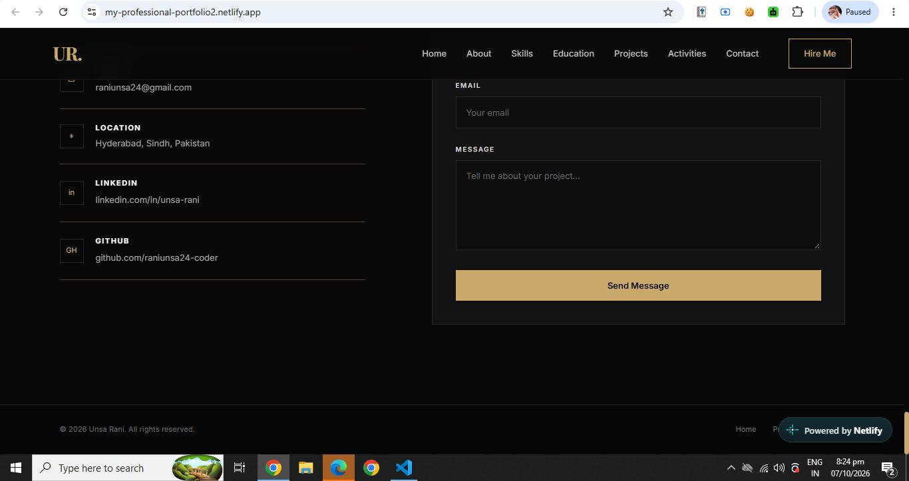

### Mobile View

| Home | Menu | Skills |
|------|------|--------|
| 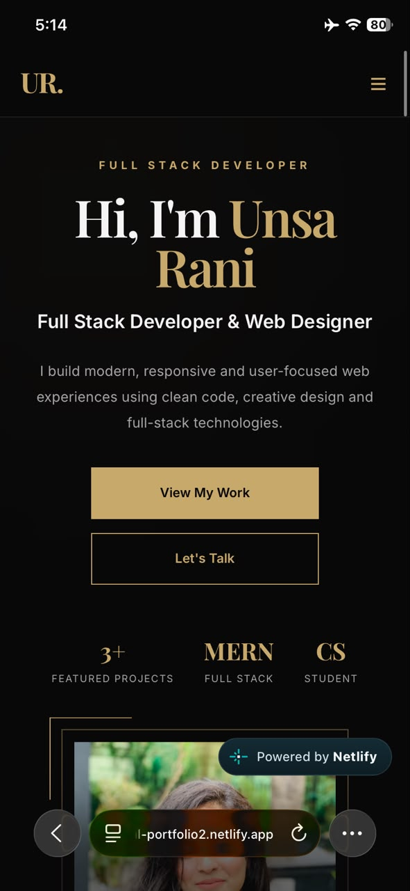 | 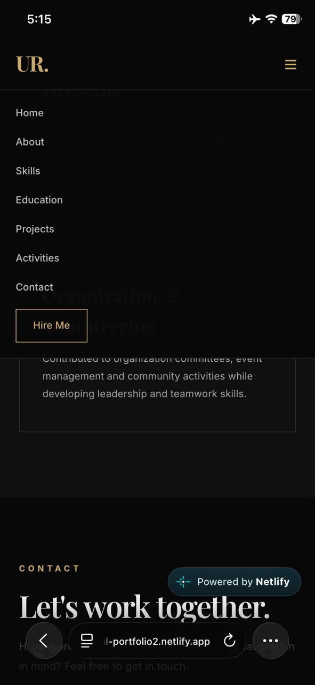 | 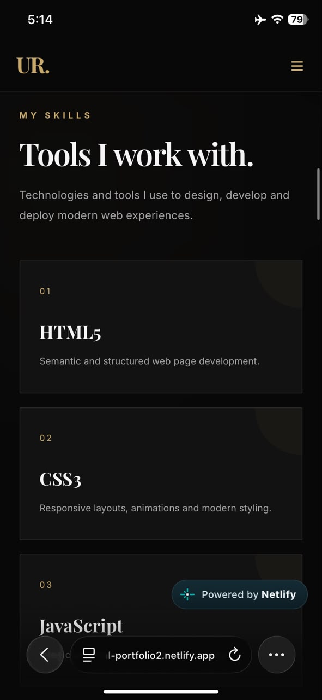 |

| Projects | Contact | Contact Form |
|----------|---------|--------------|
| 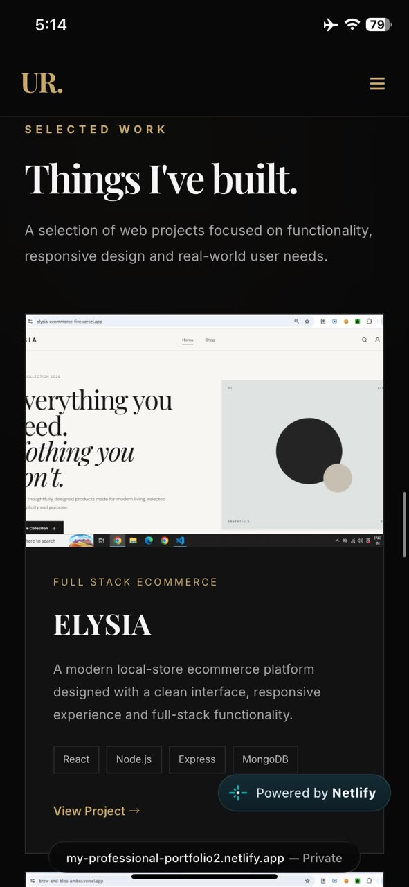 | 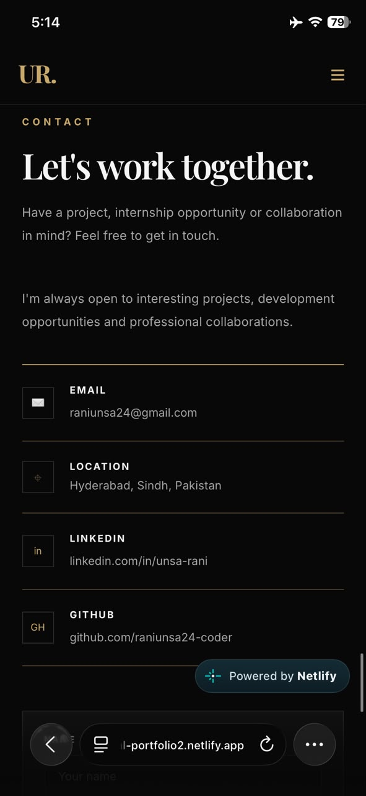 | 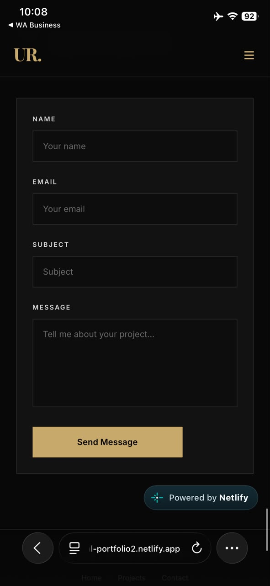 |

### Code Screenshots

**HTML: navigation bar and header**

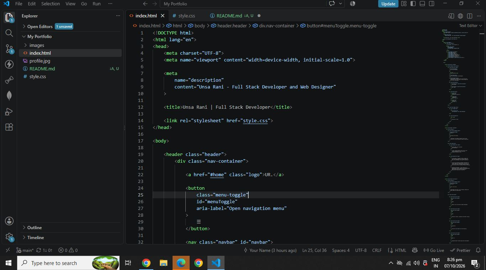

**HTML: skills section**

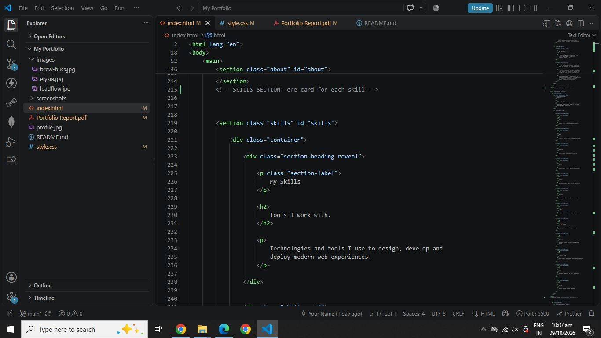

**HTML: projects section**

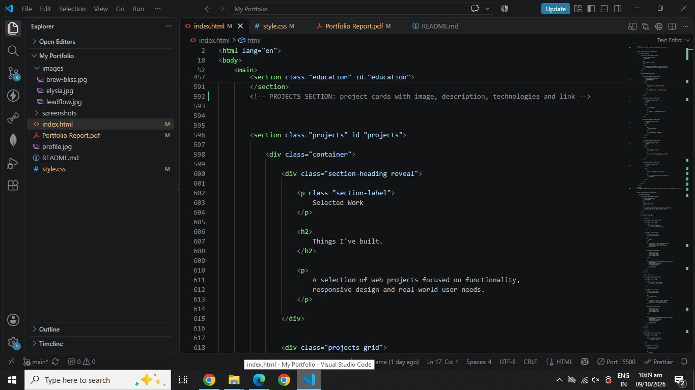

**CSS: tablet responsive styles**

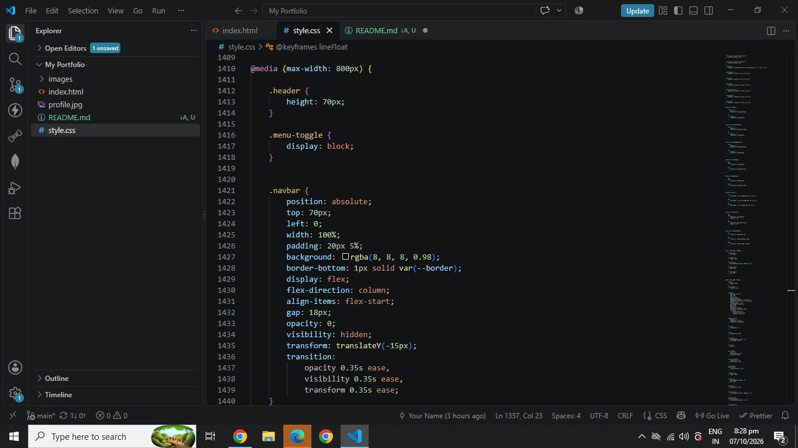

**CSS: mobile responsive styles**

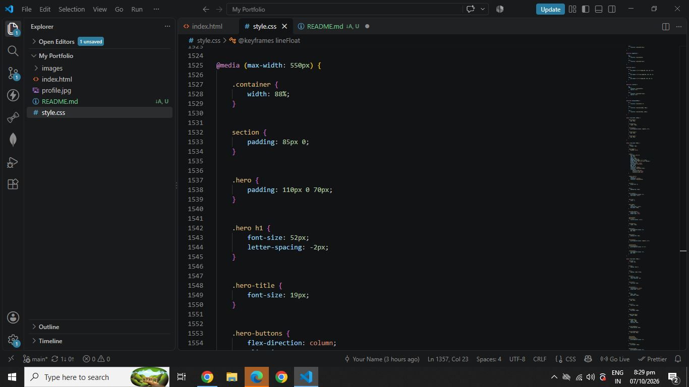

## How to Run the Website

1. Clone the repository:

   ```bash
   git clone https://github.com/raniunsa24-coder/My-Portfolio.git
   ```

2. Open the project folder:

   ```bash
   cd My-Portfolio
   ```

3. Open `index.html` in any web browser (double-click it, or right-click and choose **Open with Live Server** in VS Code).

No installation or build step is needed.

## Author

**Unsa Rani**  
Computer Science Student | Full Stack Developer & Web Designer  
Hyderabad, Sindh, Pakistan

- GitHub: [raniunsa24-coder](https://github.com/raniunsa24-coder)
- LinkedIn: [unsa-rani](https://www.linkedin.com/in/unsa-rani-02993a365/)
- Email: raniunsa24@gmail.com

---

*Devixo Solutions - Web Development Internship Program | Task 01*  
*Design. Develop. Showcase.*
